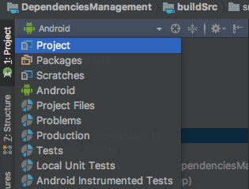
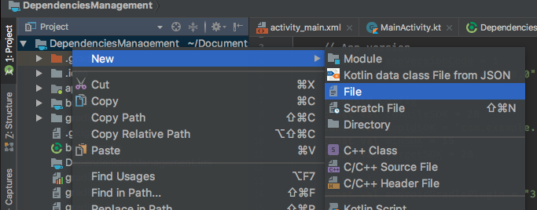
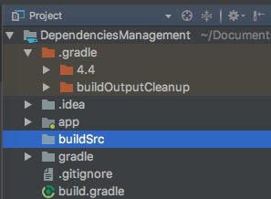
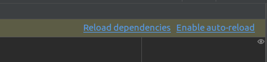
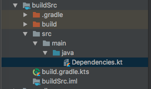
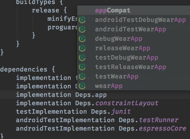
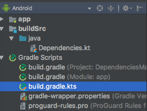

**Background**

Sering kali kita menemui momen dimana kita akan meng-update library pada gradle. Update library akan terlihat mudah apabila jumlah library atau versi library tidak terlalu banyak. Namun, Bagaimana jika projekmu memiliki banyak library katakanlah sampai beratus-ratus baris? Lantas bagaimana kamu akan mengupdate suatu library yang ingin kamu update? Jika kamu paksakan mengupdate secara manual atau menulis langsung pada String packagenya maka tingkat kesalahan versi pada suatu library akan semakin besar. Solusinya? Hmm.... Sederhana saja kita harus pisahkan nama/string package dengan String versinya.

Pemisahan String/nama package dengan versi mudah dilakukan dengan dependecies management. Gradle sudah mendukung fitur tersebut, kebanyakan developer atau google sendiri pun menggunakan variabel **ext**. Contohnya

```groovy
project.ext {
	daggerVersion = "2.13"  
}

// Dagger core
kapt "com.google.dagger:dagger-compiler:$project.daggerVersion"
implementation "com.google.dagger:dagger:$project.daggerVersion"

```

Cukup sederhana bukan? Masalahnya tidak cukup sampai disitu, masalah lainnya adalah Gradle tidak mendukung fungsi autocomplete pada IDE untuk menambahkan object **ext** ketika kamu mulai mengetik **dot**(.) hal ini akan mengurangi kenyamananmu untuk mengetik jika autocomplete tidak ada. Artinya kamu diharuskan untuk melihat file atau pemanggilan nama dari **ext** yang sudah kamu buat tadi, hal itu tidak menjadi apa jika kamu betul menuliskannya atau copas, namun bagaimana jika kamu typo dengan penulisanmu? sedang fungsi error saat typo kamu tidak dapat ditampilkan pada editor. Baiklah jawaban dan solusi diatas semua adalah dengan menggunakan kotlin dsl.


**Kotlin DSL == AutoComplete** 

Well, Kotlin DSL merupakan singkatan dari Kotlin Domain Spesific Language, singkatnya kamu akan menulis kode jadi lebih mudah dan enak dibaca. Sebelum kita beranjak lebih jauh kita harus mengetahui alur logika Gradle ketika *load* semua dependencies. berdasarkan dokumentasi resmi dari laman [Gradle](https://docs.gradle.org/current/userguide/organizing_gradle_projects.html#sec:build_sources) 

> When you run Gradle, it checks for the existence of a directory called buildSrc. Gradle then automatically compiles and tests this code and puts it in the classpath of your build script. You don’t need to provide any further instruction.

Berdasarkan pernyataan diatas, saat gradle berjalan, gradle mengecek direktori yang bernama buildSrc, lalu otomatis mengkompile dan mengetes code didalamnya kemudian menaruh atau menggenerate semua kebutuhan berdasarkan build script kamu. Kesimpulannya kita akan membuat file dengan nama **buildSrc** pada level root terlebih dahulu. 

Sekarang pilih **projek view** untuk melihat semua folder yang ada dalam projek kamu, default-nya adalah android view, kamu bisa menggantinya dengan dropdown berikut,



klik kanan pada nama project kamu lalu pilih **New -> Directory** 



kemudian beri nama **buildSrc**, hasil jadinya seperti gambar berikut:



Lalu klik kanan lagi pada folder buildSrc tersebut, buat satu buah file baru dengan ektensi kts. **New -> File** beri nama file tersebut dengan **build.gradle.kts**. Isi file tersebut dengan kode berikut, lalu setelah selesai kemudian klik reload dependencies

```kotlin
import org.gradle.kotlin.dsl.`kotlin-dsl`

plugins {
    `kotlin-dsl`
}
```




Buat direktori baru (src/main/java) pada buildSrc yang didalamnya memiliki file Dependencies.kt. klik kanan pada **buildSrc**  klik **New -> Directory** isi Directori dengan **src/main/java** lalu klik kanan lagi pada folder java untuk membuat satu file dengan nama Dependencies.kt. Struktur folder/package adalah sebagai berikut,




Edit file tersebut dengan kode kotlin untuk mendeklarasikan variabel yang bersifat immutable dan konstanta, supaya lebih nyaman dan sesuai dengan standar sebelumnya kita akan memisahkan antara string/nama package dengan versinya, sehingga ada dua buah objek yakni objek Versions dan Deps. Kita bisa menambahkan lebih banyak variabel sesuai dengan kebutuhan, contohnya adalah sebagai berikut;

```kotlin
object Versions {

    // App version
    const val appVersionCode = 1
    const val appVersionName = "1.0.0"

    // Build Config
    const val compileSDK = 28
    const val appIdSDK = "com.example.ran.dependenciesmanagement"
    const val minSDK = 15
    const val targetSDK = 28

    // Plugins
    const val androidGradlePlugin = "3.1.3"

    // Kotlin
    const val kotlin = "1.2.51"

    // Support Lib
    const val support = "27.1.1"
    const val constraintLayout = "1.1.2"

    // Testing
    const val junit = "4.12"
    const val espresso = "3.0.2"
    const val testRunner = "1.0.2"

}

object Deps {
    // Support Library
    const val appCompat = "com.android.support:appcompat-v7:${Versions.support}"
    const val supportAnnotations = "com.android.support:support-annotations:${Versions.support}"
    const val constraintLayout = "com.android.support.constraint:constraint-layout:${Versions.constraintLayout}"

    // Kotlin
    const val kotlinStdLib = "org.jetbrains.kotlin:kotlin-stdlib-jdk7:${Versions.kotlin}"
    const val kotlinGradlePlugin = "org.jetbrains.kotlin:kotlin-gradle-plugin:${Versions.kotlin}"

    // Testing
    const val junit = "junit:junit:${Versions.junit}"
    const val espressoCore = "com.android.support.test.espresso:espresso-core:${Versions.espresso}"
    const val testRunner = "com.android.support.test:runner:${Versions.testRunner}"

    // Plugins
    const val androidGradlePlugin = "com.android.tools.build:gradle:${Versions.androidGradlePlugin}"

}
```

Semua kebutuhan untuk manajemen sudah cukup, sekarang kita akan beralih pada file lain, yakni file Build.gradle pada level App module. Buka build.gradle dan update beberapa kode, coba Anda ketik sendiri lalu lihat apa yang terjadi.




Perlu diketahui sebaiknya Anda me-refresh atau sync gradle terlebih dahulu untuk memastikan semuanya beres. Nah ketika Anda menuliskan kode Deps makan setelah tanda dot(.) maka muncul autocomplete. Berdasarkan gambar diatas kita menuliskan Deps dilanjutkan tanda dot dan autocomplete pun muncul. Kini masalah selesai bukan? Manejemen dependensi semakin lebih nyaman. Nah sekarang refresh atau sync sekali lagi untuk memastikannya. Apabila ada pembaruan atau penambahan lagi mengenai library Anda bisa edit pada file **Dependecies.kt**

hasil akhir struktur package pada android view adalah sebagai berikut,




Sekian dari saya, kurang lebihnya mohon maaf. Jika Anda memilik pertanyaan atau kebingunan silakan untuk komen dibawah ini.