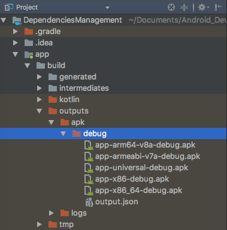

> **Catatan** bundling platform native shared library bekerja pada native support C dan C++. Artinya Anda harus mencentang Support C++ pada awal project atau menambahkan module support C++ ketika projek Anda sedang berjalan. untuk penambahan bisa dilihat [disini](https://developer.android.com/studio/projects/add-native-code) atau [disini](https://stackoverflow.com/questions/45118175/how-to-add-jni-c-c-native-code-to-existing-android-studio-project).

Konsep mengurangi size android package atau APK sebenarnya sudah bertebaran di internet. Sederhananya APK dapat dikurangi dengan memperkecil resource dalam projek didalamnya, khususnya asset berupa gambar. Berdasarkan laman web resmi [android](https://developer.android.com/topic/performance/reduce-apk-size) dapat ditarik kesimpulan bahwa rata-rata resource dari gambar merupakan hal yang paling krusial, seperti mengurangi ukuran APK dengan perintah menggunakan drawable, Crunch PNG, Compress PNG/JPG, WebP, dan Vector. Sisanya masalah optimisasi kode. 

Lalu apakah ada cara lain lagi? Tentu ada, cara lainnya dengan membagi beberapa hasil APK berdasarkan seperti faktor ukuran layar atau prosessornya. Logikanya ketika pengguna mengunduh aplikasi, device akan menerima data APK terlebih dahulu sesuai dengan fitur dan pengaturan pada device, Sehingga perangkat tidak menerima asset atau fitur yang tidak dimiliki. Misalnya saja apabila pengguna hanya memiliki layar maksimal hdpi maka perangkat tersebut tidak membutuhkan layar diatas hdpi(xxxhdpi). 

Konsep pembagian ini atau yang sering terdengar isitilahnya sebagai APK split. APK split berasal dari hasil bundling kompile native code. Serta native shared library ini menghasilkan generate pada jenis-jenis platform seperti (**armeabi-v7a, arm64-v8a, x86, x86_64**). Alhasil apabila disatukan semuanya terkandung dalam format .APK. Sederhananya, supaya ukuran apk dapat berkurang yakni dengan memisahkan satuan apk yang besar tersebut menjadi beberapa platform. 

> *Berdasarkan dokumentasi laman resmi Android Gradle*
>
> The splits block is where you can configure different APK builds that each contains only code and resources for a supported screen density or ABI.

Arti dalam keterangan diatas adalah komponen pembagian diatur atau dikonfigurasi berdasarkan perbedaan APK builds yang didalam hanya terdapat kode dan resource yang mendukung densitas layar atau Application Binary Interface (ABI). Bagi yang belum tahu ABI bisa ke laman [ini](https://developer.android.com/ndk/guides/abis). Ringkasnya ABI merupakan kumpulan perintah atau definisi untuk bagaimana kode berinteraksi dengan sistem sesuai arsitektur Central Processor Unit(CPU) yang digunakan.

Implementasi split APK adalah dengan menambahkan kode blok **split** didalam blok **android** pada app module.

```kotlin
android {
    compileSdkVersion 28
    defaultConfig {
        applicationId Versions.appIdSDK
        minSdkVersion Versions.minSDK
        targetSdkVersion Versions.targetSDK
        versionCode Versions.appVersionCode
        versionName Versions.appVersionName
        testInstrumentationRunner "android.support.test.runner.AndroidJUnitRunner"
    }
    buildTypes {
        release {
            minifyEnabled false
            proguardFiles getDefaultProguardFile('proguard-android.txt'), 'proguard-rules.pro'
        }
    }

    splits{
        //pengaturan untuk membuat multiple APK dengan ABI
        abi{
            //enable untuk build multiple APK
            enable true
            //secara default ABI akan build semuanya sehingga harus dikhususkan.
            reset()
            //menspesifikasikan list apk yang ingin dibuat
            include "armeabi-v7a", "arm64-v8a", "x86", "x86_64"
            //menspesifikasian generate universal API
            universalApk true
        }
        //pengaturan membuat multiple APK berdasarkan density
        density{
            //hilangkan density based APK
            enable false
            //tidak menspesifikasikan hasil densitas sebagai berikut
            exclude "400dpi", "560dpi", "ldpi", "tvdpi", "xxxhdpi"
        }
    }

    //Mapping kode versi setiap apk yang di-build berdasarkan ABI
    project.ext.versionCodes = ['armeabi-v7a': 1, 'arm64-v8a': 2, 'x86': 3, 'x86_64': 4]

    //iterasi semua komponen yang sudah dispesifikan/generate, 
    //lalu set ke masing-masing versi
    android.applicationVariants.all {
        variant ->
            variant.outputs.each {
                output -> output.versionCodeOverride =

                        project.ext.versionCodes.get(output
                                .getFilter(com.android.build.OutputFile.ABI), 0) *
                                100000 +
                                android.defaultConfig.versionCode
            }
    }
}
```

Jangan lupa untuk refresh gradle dan pastikan hasilnya sukses seperti berikut,


Setelah berhasil melakukan refresh gradle, silakan **Make project** dengan cara navigasikan ke menu **Build -> Make Project**. Kemudian tunggu beberapa saat, gradle akan melakukan build sampai selesai. Ketika proses build selesai, segera ganti view Anda dari **Android view** ke **Project view** lalu cari direktori pada **'nama_project'/app/build/outputs/apk/debug**. Coba cek hasilnya, gradle berhasil mem-build apk berdasarkan spesifikasi yang kita buat tadi.



Coba silakan cek hasilnya, namun metode ini juga masih belum berhasil, terkadang APK split tidak dapat mengurangi ukuran apk yang sudah di-generate. Kemungkinan besar terdapat masalah pada Android studio. Masalah ini belum dapat respons banyak, Anda bisa melihatnya pada [stackoverflow](https://stackoverflow.com/questions/48945762/not-able-to-reduce-android-apk-size-using-splits) yang mengalami masalah serupa. Atau bahkan Bermasalah pada ketiadaan native C++ pada projek Anda.